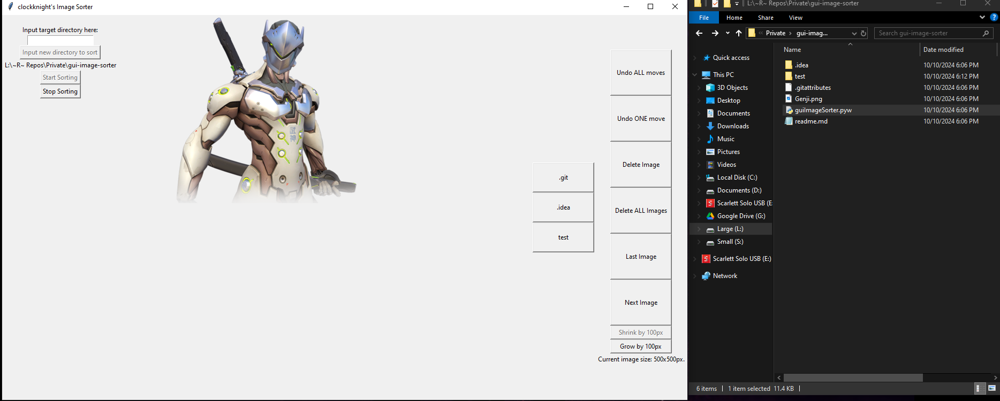

Projects which I use to help myself automate tasks.

<table>

<tr>
<th class="rowtitle">
<h3><a href="https://github.com/Clockknight/heirarchy-helper">
HEIRARCHY HELPER
</a></h3>
A <a href="http://discord.gg">Discord</a> bot that allows you to define relations between roles on your server.
</th>

<th class="rowcontent">
The primary usage of the bot is to enforce a heirarchy between roles. 

In this case, heirarchy would mean if you get a "lower" role for whatever reason, the bot will automatically detect the change, and give that user the "higher" role.
</th>
</tr>

<tr class="spacer"></tr>

<tr>
<th class="rowtitle">
<h3><a href="https://github.com/Clockknight/album-downloader">
ALBUM DOWNLOADER
</a></h3>
Downloads songs based on information available on <a href="http://Discogs.com">Discogs</a>.

<i>Note: While the code itself works, it relies on the pytube library, which does not work as of writing this.</i> 

</th>

<th class="rowcontent">
Releases is the umbrella term Discogs uses for singles, albums, and eps.
 
This code stores information about releases that are downloaded, then when the user runs the update option, the code will also download all releases that have yet to be downloaded.
 
Infomation about the songs are pulled from a json file and used to tag the MP3s as they are downloaded, including album art, album name, and artist name.
</th>
</tr>

<tr class="spacer"></tr>

<tr>
<th class="rowtitle">
<h3><a href="https://github.com/Clockknight/deckbox-exporter">
DECKBOX EXPORTER
</a></h3>

Takes a .csv from <a href="https://deckbox.org/">Deckbox</a>, and updates your <a href="https://www.tcgplayer.com/">TCGPlayer</a> Seller Inventory to match.
</th>
<th class="rowcontent">
The process has to actually input the values on TCGPlayer's website. I attempted to use TCGPlayer's API to make the process faster, but it did not support manipulating an account's cards available for sale.
 
Very useful when trying to export your inventory of Magic: The Gathering cards from the Deckbox site to TCGPlayer, if you're looking to sell some of your collection.
</th>
</tr>

<tr class="spacer"></tr>

<tr>
<th class="rowtitle">
<h3><a href="https://github.com/Clockknight/gui-image-sorter">
GUI IMAGE SORTER
</a></h3>

Using the TKInter package to create a GUI that allows you to sort images into subdirectories.

</th>
<th class="rowcontent">
Primary purpose of the code is that you can preview images as you put them into different folders, and all folders are relatively accessible, being able to sort them with all controls available on one window regardless of which file you're looking at.
 
Code is missing some features, which are brought up on the repository's issues page.
</th>
</tr>

<tr class="spacer"></tr>

<tr>
<th class="rowtitle">
<h3><a href="https://github.com/Clockknight/daily-countdown-timer">
DAILY COUNTDOWN TIMER
</a></h3>

Code to be a companion to a Rainmeter extension. Resets the extension's timer daily.
</th>
<th class="rowcontent">
Daily Countdown Timer is intended to specifically work with the Rainmeter extension "Magnumizer's Countdown Timer", that will update the date to today, leaving the time untouched.
 
This program will prompt for a location of thfe timer settings, if it doesn't already have a location saved. It'll save it by putting it to a .txt file in the same directory as the script.
</th>
</tr>

<tr class="spacer"></tr>

<tr>
<th class="rowtitle">
<h3><a href="https://github.com/Clockknight/file-raiser">
FILE RAISER
</a></h3>

File Raiser will recursively search for any files in a directory and its subdirectories, moving them up to the initial directory. 
</th>
<th class="rowcontent">
Earliest self-started project. Only script in the list that involves command line arguments. 
 
Also imports pyperclip, since I didn't understand you could just paste things into command line at the time.
</th>
</tr>
</table>

## [Unity Games](https://clockknight.itch.io/)

Personal itch.io page. Contains games, mostly in prototype stages or proof of concepts. 

<table>

<tr>
<th class="rowtitle">
<h3><a href="https://clockknight.itch.io/chronal-combat">Chronal Combat</a></h3>

Fighting game. 

Currently building a prototype.
</th>
<th class="rowcontent">

One of my favorite hobbies is playing fighting games, would love to create one of my own in time.
</th>
</tr>

<tr class="spacer"></tr>

<tr>
<th  class="rowtitle">
<h3><a href="https://clockknight.itch.io/speedy-scroller">Speedy Scroller</a></h3>

Incremental Game concept. 
</th>
<th class="rowcontent">

Built over a week in vacation, trying to get an idea of how scaling should work for these types of games.
</th>
</tr>

</table>

### [GameJams](https://github.com/EagleJammers)

In addition, I work with other EWU students in a Github organization, participating regularly in the 
<a href="https://trijam.itch.io/">TriJam Game Jam</a>.
Prototype source codes are available on the appropriate repositories.

Submissions are available on this <a href="https://ohhm.itch.io/">itch.io page</a>.

<table>

<tr>
<th class="rowcontent">
<ul><li>No submissions I've contributed to have been completed and submitted yet!</li></ul>
</th>
</tr>

</table>

